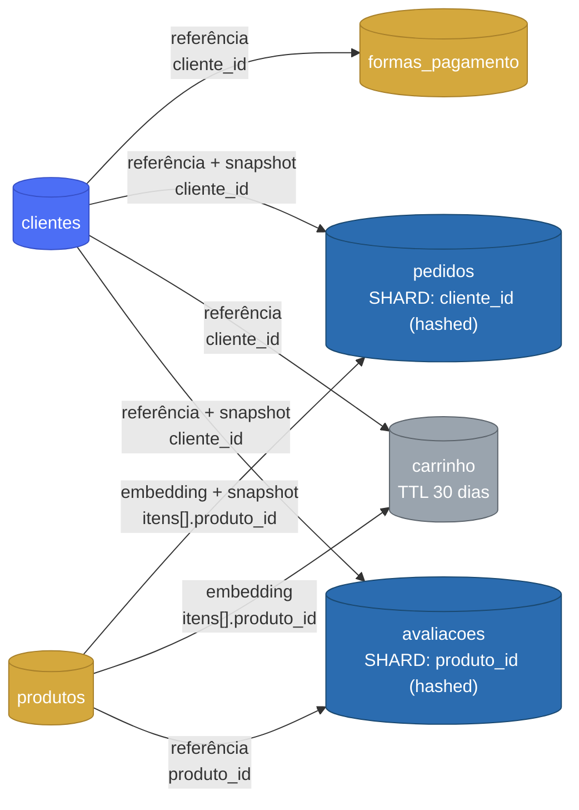

# Desafio Final — Arquiteto(a) de Dados: Loja "Amazonas"

Projeto de arquitetura de dados não-relacional para um e-commerce fictício ("Amazonas"), feito para o
Desafio Final do Bootcamp Arquiteto(a) de Dados (professor João Paulo Faria). O foco é modelar
coleções NoSQL desnormalizadas e propor uma estratégia de escalabilidade (sharding + réplica) para
suportar crescimento rápido de clientes e transações, com alta disponibilidade.

## O modelo



6 coleções, sem joins: o que precisa ser lido junto (itens do pedido, endereço do cliente) é
embutido; o que cresce sem limite e é reaproveitado em vários lugares (histórico de um cliente,
pedidos de um produto) é referenciado; e o que precisa preservar "como era no momento da compra"
(nome, endereço, forma de pagamento no pedido) vira um snapshot. O raciocínio completo de cada
decisão está no Documento Arquitetural.

## Documento Arquitetural

O entregável principal é [`docs/documento-arquitetural.md`](docs/documento-arquitetural.md):
descrição do sistema, as 6 coleções detalhadas com o diagrama modelado no Hackolade, o plano de
escalabilidade (o que particiona, o que replica, crescimento de dados, concorrência) e uma visão de
implementação em Atlas/DynamoDB.

## Estrutura do repositório

```
apsilva-data-architect-challenge/
├── README.md
├── Makefile                          ← atalhos para a implementação opcional em Docker
├── docker-compose.yml                ← cluster MongoDB local (3 nós + seed)
├── mongo-init/                       ← scripts que inicializam o replica set e populam os dados
├── schemas/                          ← JSON Schema das 6 coleções (usado para modelar no Hackolade)
└── docs/
    ├── documento-arquitetural.md     ← entregável principal
    ├── EVIDENCIAS.md                 ← evidências da implementação opcional
    ├── screenshots/                  ← diagrama do Hackolade e prints do MongoDB
    └── implementacao-docker-mongodb.md
```

## Implementação opcional (MongoDB via Docker)

Como bônus, o modelo também foi implementado num cluster MongoDB local (replica set de 3 nós),
demonstrando réplica e alta disponibilidade na prática:

```bash
make up             # sobe os 3 nós MongoDB + roda o seed
make status          # confere o replica set (1 PRIMARY, 2 SECONDARY)
make seed-status     # confere a contagem de documentos por coleção
```

Detalhes, como testar failover e troubleshooting em
[`docs/implementacao-docker-mongodb.md`](docs/implementacao-docker-mongodb.md).

## Requisitos atendidos

1. **Modelagem não-relacional**: 6 coleções desnormalizadas, sem joins, desenhadas no Hackolade.
2. **Escalabilidade**: estratégia de sharding + réplica, explicando o que particiona, o que replica, e por quê.
3. **Documento Arquitetural**: descrição do sistema, estrutura de dados, plano de escalabilidade e visão de implementação em Atlas/DynamoDB.
4. **Opcional**: banco de dados funcionando com réplica, em [`docs/implementacao-docker-mongodb.md`](docs/implementacao-docker-mongodb.md).
