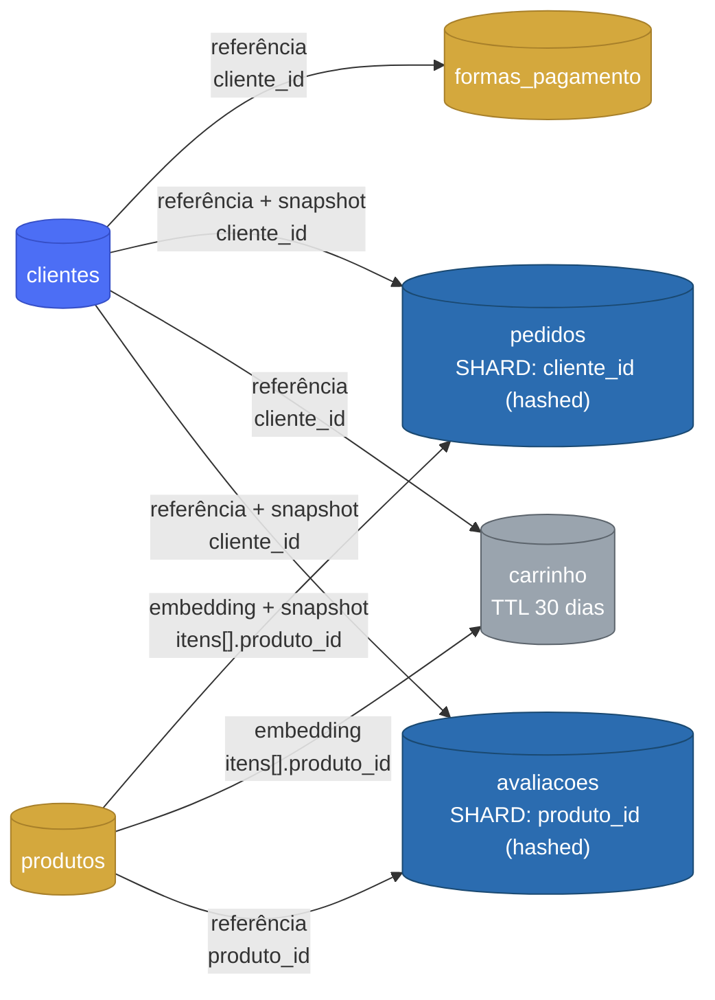

# Desafio Final — Arquiteto(a) de Dados: Loja "Amazonas"

**Guia de estudos + entregáveis do Desafio Final do Bootcamp Arquiteto(a) de Dados** (professor João
Paulo Faria): projetar a arquitetura de dados não-relacional de um e-commerce fictício, a "Amazonas",
com foco em escalabilidade, alta disponibilidade e modelagem NoSQL.

Este repositório foi escrito **para leigos** — não pressupõe nenhuma experiência prévia com bancos
NoSQL, modelagem de dados ou arquitetura distribuída. Se você nunca ouviu falar em "sharding" ou
"documento" antes de hoje, comece pelo passo 1 abaixo.

> Nunca leu o enunciado? Comece por [`Enunciado do Desafio Final - ... .pdf`](<Enunciado do Desafio Final - Módulo Desafio - Arquiteto(a) de dados.pdf>) — é a fonte de verdade de tudo que este repositório tenta resolver.

## O modelo, em um diagrama



6 coleções, sem joins: tudo que precisa ser lido junto (itens do pedido, endereço do cliente) é
**embutido**; tudo que cresce sem limite e é reaproveitado em vários lugares (o histórico de um
cliente, os pedidos de um produto) é **referenciado**; e tudo que precisa preservar "como era no
momento da compra" (nome, endereço, forma de pagamento no pedido) vira um **snapshot**. O porquê de
cada seta está detalhado no [passo 1](docs/guia-de-estudos/).

## Como usar este repositório (percurso recomendado)

Este projeto é organizado como um percurso passo a passo — siga a ordem abaixo. Cada passo entrega um
pedaço do que o enunciado pede, e assume que você só leu os anteriores.

| Passo | Onde | O que você aprende / produz | Requisito do enunciado |
|---|---|---|---|
| 1 | [`docs/guia-de-estudos/`](docs/guia-de-estudos/) | Os 4 fundamentos teóricos: relacional vs. NoSQL, embedding/referência/snapshot, escalabilidade horizontal, panorama de arquiteturas atuais | Objetivos de Ensino 1-4 |
| 2 | [`docs/modelagem-hackolade/`](docs/modelagem-hackolade/) | Desenhar as 6 coleções no Hackolade, passo a passo (com schemas prontos pra importar) | Requisito 1 |
| 3 | [`docs/documento-arquitetural/`](docs/documento-arquitetural/) | O documento Word/PDF final, com um rascunho completo já escrito | Requisito 3 |
| 4 (opcional) | [`docs/implementacao-docker-mongodb.md`](docs/implementacao-docker-mongodb.md) | Rodar o modelo de verdade num cluster MongoDB local (replica set + failover) | "Opcional: banco de dados funcionando" |

## Estrutura do repositório

```
apsilva-data-architect-challenge/
├── README.md                                  ← você está aqui
├── Enunciado do Desafio Final - ... .pdf       ← enunciado original do professor
├── Makefile                                    ← atalhos pra rodar a implementação opcional (passo 4)
├── docker-compose.yml                          ← sobe o cluster MongoDB local (passo 4)
├── mongo-init/                                 ← scripts que inicializam o replica set + populam os dados (passo 4)
└── docs/
    ├── ESTRUTURA-DO-PROJETO.md                 ← detalhamento arquivo a arquivo
    ├── EVIDENCIAS.md                           ← checklist dos entregáveis + espaço pros prints
    ├── screenshots/                            ← os prints em si
    ├── guia-de-estudos/                        ← passo 1
    ├── modelagem-hackolade/                    ← passo 2 (+ schemas/ prontos pra importar)
    ├── documento-arquitetural/                 ← passo 3 (rascunho pronto pra exportar)
    └── implementacao-docker-mongodb.md         ← passo 4 (opcional)
```

Detalhamento completo de cada arquivo em [`docs/ESTRUTURA-DO-PROJETO.md`](docs/ESTRUTURA-DO-PROJETO.md).

## Rodando a implementação opcional (passo 4)

`docker-compose.yml`, `Makefile` e `mongo-init/` ficam na raiz do repositório (não é preciso entrar em
nenhuma subpasta):

```bash
make up             # sobe os 3 nós MongoDB + roda o seed
make status          # confere o replica set (1 PRIMARY, 2 SECONDARY)
make seed-status     # confere a contagem de documentos por coleção
```

Guia completo (o que cada comando faz, como testar failover, troubleshooting) em
[`docs/implementacao-docker-mongodb.md`](docs/implementacao-docker-mongodb.md).

## Status da entrega

- [x] Guia de estudos cobrindo os 4 objetivos de ensino do enunciado — [`docs/guia-de-estudos/`](docs/guia-de-estudos/)
- [x] Modelagem conceitual das 6 coleções (clientes, produtos, formas_pagamento, pedidos, carrinho, avaliações), com schemas prontos pra importar no Hackolade — [`docs/modelagem-hackolade/`](docs/modelagem-hackolade/)
- [x] Rascunho completo do Documento Arquitetural (contexto, estrutura de dados, plano de escalabilidade, visão Atlas/DynamoDB) — [`docs/documento-arquitetural/documento-arquitetural.md`](docs/documento-arquitetural/documento-arquitetural.md)
- [x] Implementação opcional em Docker (MongoDB replica set) + Makefile — [`docs/implementacao-docker-mongodb.md`](docs/implementacao-docker-mongodb.md)
- [ ] Diagrama desenhado de fato no Hackolade e exportado como imagem — **pendente, é uma ação manual sua** (o passo 2 te guia)
- [ ] Documento Arquitetural exportado em PDF com nome/data preenchidos — **pendente, é uma ação manual sua** (o passo 3 te guia)

As duas pendências acima não têm como ser fechadas só com código: exigem você abrir o Hackolade e
desenhar/exportar, e revisar/exportar o documento final com seus próprios dados. O restante do
repositório já está pronto pra te levar até lá.

## Requisitos do enunciado, em uma frase

1. **Modelagem não-relacional**: pelo menos 5 coleções, desnormalizadas, sem joins, desenhadas no Hackolade.
2. **Escalabilidade**: estratégia de sharding + réplica, explicando o que particiona, o que replica, e por quê.
3. **Documento Arquitetural**: Word/PDF reunindo descrição do sistema, estrutura de dados, plano de escalabilidade e (bônus) visão de implementação em Atlas/DynamoDB.

## Notas de design (por que este projeto é organizado assim)

- **Estrutura no estilo `docker-compose.yml`/`Makefile`/código na raiz, documentação em `docs/`** —
  o mesmo padrão do [`apsilva-data-platform-open-source`](https://github.com/alessandro-psilva/apsilva-data-platform-open-source):
  o que é executável fica solto na raiz, o que é conteúdo/explicação fica agrupado em `docs/`. A ordem
  de leitura (passo 1 a 4) vive na tabela acima, não em prefixos numéricos nos nomes de pasta.
- **O opcional fica claramente separado do obrigatório** — o enunciado é explícito que nada precisa
  ser implementado em banco/nuvem; por isso a implementação Docker é o *último* passo, marcada como
  opcional em todo lugar que aparece, nunca um pré-requisito dos passos 1-3.
- **Schemas JSON reais, não só uma descrição em texto** — [`docs/modelagem-hackolade/schemas/`](docs/modelagem-hackolade/schemas/)
  guarda um JSON Schema por coleção, derivado diretamente dos dados de exemplo usados na implementação
  Docker, para importar no Hackolade sem digitar 6 entidades do zero.
- **O Documento Arquitetural já vem com um rascunho completo** — não é um template vazio; é o texto
  do guia de estudos reescrito no registro formal de um documento técnico, na ordem exata que o
  enunciado pede (não na ordem didática dos módulos de ensino).
- **`Makefile` na raiz** — os comandos do dia a dia (`make up`, `make status`, `make failover-test`,
  `make demo`) evitam ter que decorar a sintaxe de `mongosh`/`docker compose` toda vez que for tirar
  um print de evidência.
