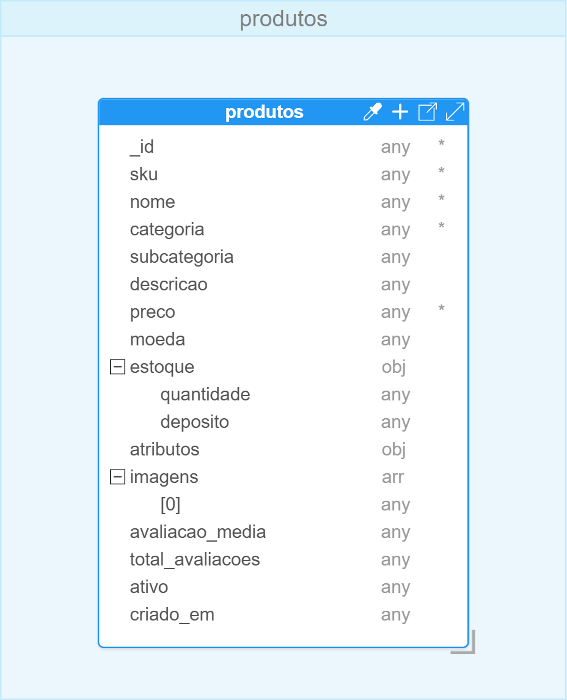
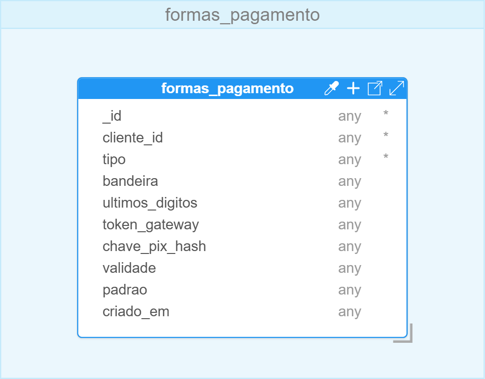
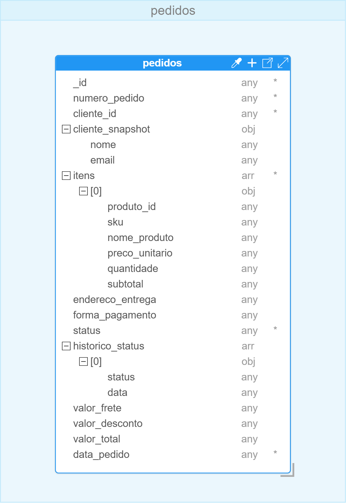
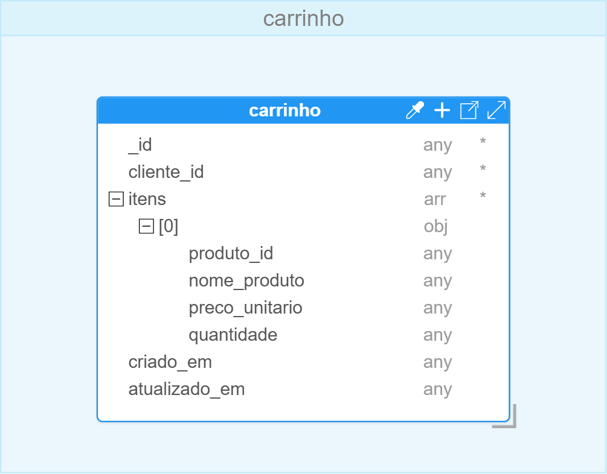
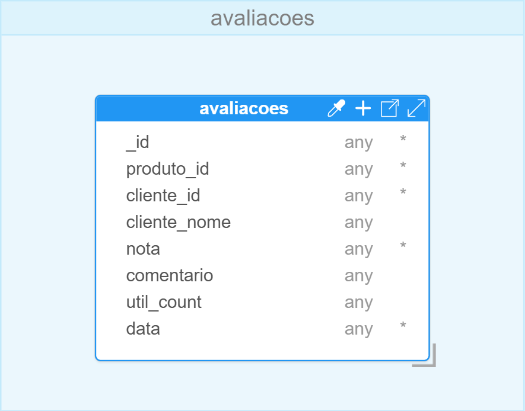

# Evidências

Registro das evidências dos entregáveis pedidos no enunciado (ver "Resumo dos Entregáveis" na última
página do PDF).

| # | Entregável | Obrigatório? | Onde |
|---|---|---|---|
| 1 | Arquitetura de dados (diagrama Hackolade) | Sim | Seção 2.3 de [`documento-arquitetural.md`](documento-arquitetural.md) |
| 2 | Explicação da estrutura e dos elementos da solução | Sim | Seção 2 de [`documento-arquitetural.md`](documento-arquitetural.md) |
| 3 | Explicação do particionamento e da replicação | Sim | Seção 3 de [`documento-arquitetural.md`](documento-arquitetural.md) |
| 4 | Opcional: banco de dados funcionando | Não | [`implementacao-docker-mongodb.md`](implementacao-docker-mongodb.md) |
| 5 | Opcional: particionamento e réplicas funcionando | Não | Réplica: sim. Sharding: só descrito no documento (ver nota abaixo) |
| 6 | Opcional: implementação em nuvem (Atlas ou DynamoDB) | Não | Seção 4 de [`documento-arquitetural.md`](documento-arquitetural.md) |

**Sobre sharding**: o ambiente Docker sobe um replica set real, mas não um cluster com sharding —
isso exigiria config servers, múltiplos shards e um roteador `mongos`. A estratégia de particionamento
está descrita e justificada na seção 3 do Documento Arquitetural.

---

## Diagrama do modelo (Hackolade)

As 6 coleções, modeladas no Hackolade:








## Banco de dados funcionando (MongoDB replica set)

Reproduzir a partir da raiz do repositório: `make demo`.

- `docker ps` (os 3 nós + o container de setup)
- `rs.status()` — um PRIMARY e dois SECONDARY (`make status`)
- Contagem de documentos por coleção (`make seed-status`)
- Teste de failover (`make failover-test`)

*(Prints pendentes.)*

## Como reproduzir

```bash
cd apsilva-data-architect-challenge
make demo              # reset completo + sobe a stack + espera o seed terminar + mostra status
make failover-test     # opcional: prova a alta disponibilidade
```
