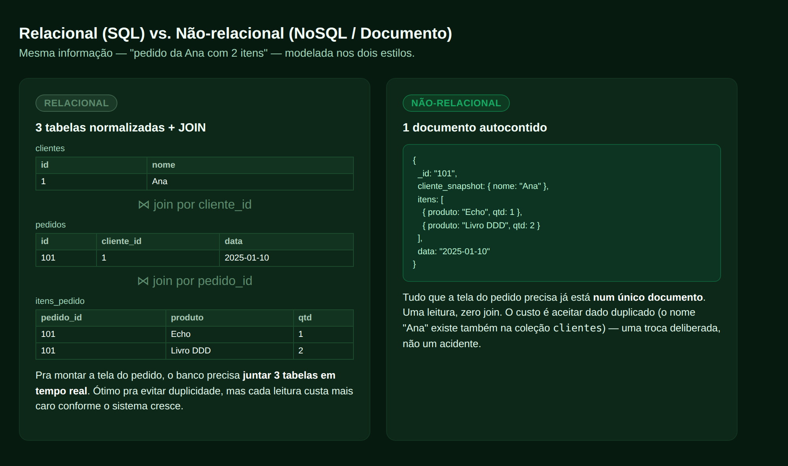
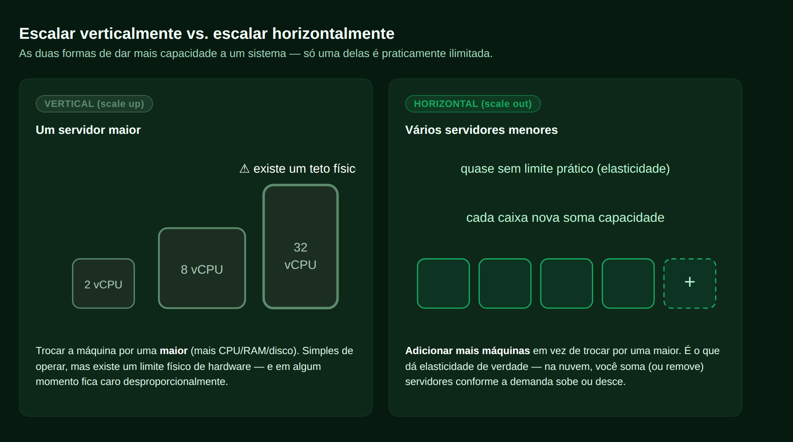
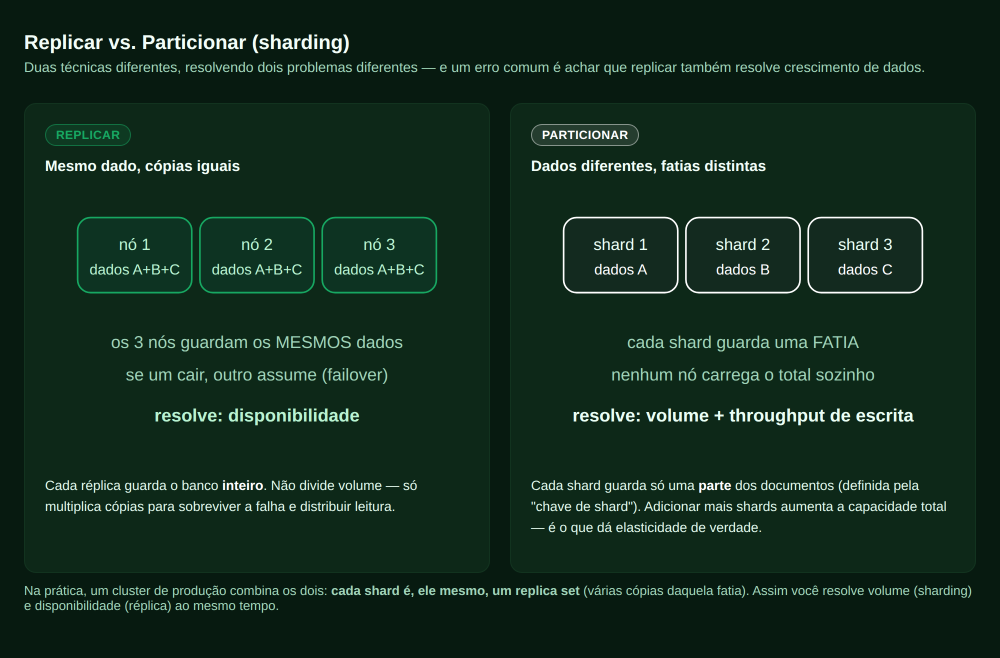
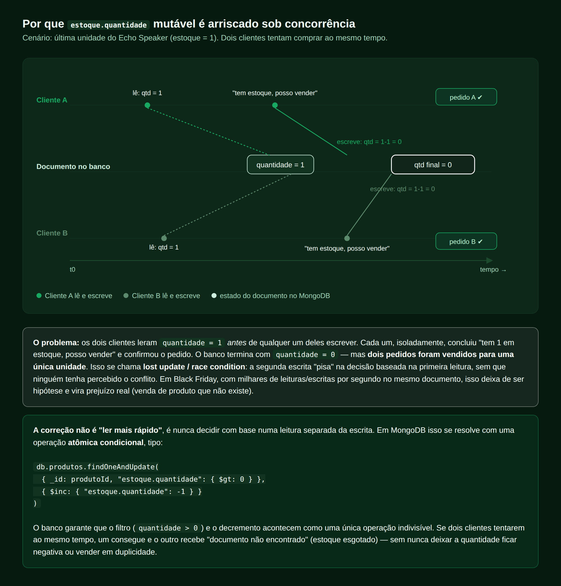
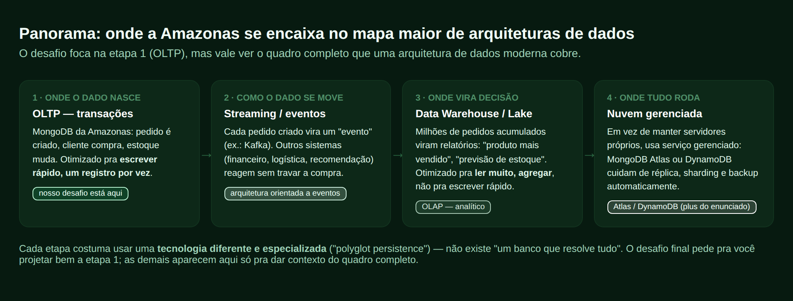

# Passo 1 de 4 — Guia de Estudos: Arquitetura de Dados
### (baseada nos 4 objetivos de ensino do Desafio Final — Loja "Amazonas")

> Você está no **passo 1** do percurso deste repositório. Veja o [README da raiz](../../README.md#como-usar-este-repositório-percurso-recomendado) para o mapa completo. Depois deste guia, o próximo passo é [`modelagem-hackolade/`](../modelagem-hackolade/).

Este guia explica, do zero e em linguagem simples, os quatro temas que o enunciado do Desafio Final diz que você precisa exercitar. Se você nunca ouviu falar em NoSQL, sharding ou "documento" antes de hoje, está no lugar certo — nenhum conhecimento prévio de banco de dados é necessário para acompanhar:

1. Fundamentos de Arquitetura de Dados
2. Modelagem Não-Relacional
3. Arquitetura de Dados Escaláveis
4. Principais Arquiteturas de Dados da Atualidade

Cada conceito vem seguido de "como isso apareceu no nosso desafio" — usando as decisões que já tomamos pro e-commerce da Amazonas como exemplo concreto. A ideia é que, depois de ler isso, você consiga explicar (pra você mesmo, ou numa banca) *por que* cada escolha do Documento Arquitetural foi feita, não só *o que* foi escolhido.

Tem ainda um **Módulo 5, bônus**, que pega esses mesmos conceitos e mostra onde eles aparecem, linha por linha, no código real que sobe o banco (os scripts em `mongo-init/`) — útil se você for tentar a implementação opcional em Docker e quiser entender o que cada arquivo `.sh`/`.js` está fazendo, não só copiar e colar.

---

## Módulo 1 — Fundamentos de Arquitetura de Dados

### 1.1 O que é "arquitetura de dados", afinal?

Antes de escrever qualquer linha de código, alguém precisa decidir: onde os dados vão morar, como vão ser organizados, quem pode acessar o quê, o que acontece se um servidor cair, o que acontece se o volume de dados multiplicar por 100. Isso é arquitetura de dados — o conjunto de decisões estruturais sobre como os dados de um sistema são armazenados, organizados, acessados e protegidos, tomadas *antes* da implementação, porque são caras (às vezes impossíveis) de mudar depois.

É parecido com a arquitetura de um prédio: você decide a fundação, onde ficam os pilares e os elevadores antes de erguer a primeira parede. Trocar a fundação depois que o prédio está pronto é uma reforma monumental — trocar o modelo de dados depois que o sistema já tem 10 milhões de usuários também é.

### 1.2 A divisão fundamental: banco relacional vs. banco não-relacional (NoSQL)

Durante décadas, "banco de dados" era praticamente sinônimo de **banco relacional** (SQL): os dados vivem em **tabelas** (linhas e colunas), cada tabela representa uma entidade (clientes, pedidos, produtos), e entidades relacionadas ficam em tabelas separadas, conectadas por **chaves estrangeiras**. Pra montar uma informação completa (ex.: "o pedido da Ana, com nome dela e os itens comprados"), o banco precisa **juntar (JOIN)** várias tabelas em tempo real.

Esse modelo é ótimo pra consistência e para evitar dado duplicado (**normalização**) — mas tem um limite prático: à medida que o sistema cresce (mais tabelas, mais linhas, mais JOINs simultâneos), fica cada vez mais caro escalar um banco relacional tradicional para múltiplos servidores, porque ele foi desenhado pensando numa máquina só coordenando tudo.

Foi esse limite que, lá pelos anos 2000, levou empresas como Google, Amazon e Facebook — que precisavam atender milhões de usuários simultâneos — a criar uma nova geração de bancos: os **NoSQL** ("Not Only SQL"). A ideia central: abrir mão de parte da rigidez/normalização do modelo relacional em troca de estruturas mais simples de distribuir entre muitos servidores.



Repare na imagem: no modelo relacional, a tela de um pedido exige juntar 3 tabelas na hora da leitura. No modelo de documento (o estilo do MongoDB, que usamos no desafio), o pedido já nasce como **um único documento autocontido** — a leitura fica muito mais barata, ao custo de aceitar dado duplicado de propósito.

### 1.3 Por que a Amazonas escolheu NoSQL

O enunciado já entrega essa resposta: a Amazonas quer crescimento "rápido e exponencial" de clientes e transações, mantendo performance e disponibilidade, com escalabilidade (e se possível elasticidade). Esse é exatamente o cenário em que bancos relacionais tradicionais mostram seus limites primeiro — e onde NoSQL foi desenhado para ser forte. Além disso, o catálogo da Amazonas é heterogêneo (eletrônicos, roupas, livros) — cada categoria tem atributos bem diferentes, o que combina com o **esquema flexível** típico de bancos de documento (mais sobre isso no Módulo 2).

---

## Módulo 2 — Modelagem Não-Relacional

### 2.1 Nem todo NoSQL é igual

"NoSQL" é um guarda-chuva que cobre pelo menos 4 famílias bem diferentes de banco:

- **Banco de documentos** (MongoDB, Couchbase): cada registro é um documento tipo JSON, que pode ter estruturas aninhadas. É o que usamos no desafio.
- **Chave-valor** (Redis, DynamoDB em seu uso mais simples): cada registro é só uma chave apontando pra um valor — extremamente rápido, mas sem estrutura de consulta rica.
- **Coluna larga** (Cassandra, HBase): pensado pra escrever volumes gigantescos de dados (ex.: logs, telemetria) de forma muito rápida.
- **Grafo** (Neo4j): otimizado pra representar e consultar relacionamentos complexos entre entidades (ex.: rede social, sistema de recomendação).

O enunciado pede especificamente o modelo de **documentos** via MongoDB (ou DynamoDB, que também suporta documentos), então é nele que vamos focar.

### 2.2 Documento, coleção e chave primária

Em MongoDB, o que seria uma "tabela" no relacional vira uma **coleção**, e o que seria uma "linha" vira um **documento**. A diferença crucial: dentro de uma mesma coleção, documentos **não precisam ter os mesmos campos** — é o chamado *schema flexível*. Um produto "eletrônico" pode ter `voltagem` e `garantia_meses`; um produto "livro" pode ter `autor` e `isbn`; nenhum dos dois precisa de colunas vazias pra acomodar o atributo do outro (que é o que aconteceria numa tabela SQL rígida).

Todo documento tem um identificador único, o campo `_id`. No nosso modelo, usamos o tipo padrão do MongoDB, `ObjectId` — um valor gerado pela própria aplicação (sem precisar perguntar ao banco "qual o próximo número livre?"), combinando um timestamp + um identificador do processo + um contador. Essa combinação torna a chance de dois `ObjectId` colidirem, gerados em qualquer lugar do mundo ao mesmo tempo, astronomicamente pequena — o que é essencial quando (no Módulo 3) o sistema estiver espalhado por vários servidores.

### 2.3 A virada de chave: modelar pensando na leitura, não na "pureza" do dado

Em banco relacional, a regra de ouro é normalizar (cada fato mora num único lugar). Em MongoDB, a regra de ouro se inverte: **modele pensando em como a informação vai ser lida na tela**, e aceite duplicar dado quando isso evita uma consulta cara. O enunciado do desafio até avisa: "evite joins, faça uso de coleções desnormalizadas".

Isso leva a uma decisão que aparece toda hora ao desenhar coleções: **embutir (embedding) ou referenciar?** As perguntas que usamos pra decidir, em cada uma das 6 coleções do nosso modelo:

1. **O filho tem tamanho limitado, ou cresce sem fim?** Itens de um pedido têm um teto razoável → embutir. Pedidos de um cliente, ao longo de anos, não têm teto → referenciar (`cliente_id`).
2. **O filho é sempre lido junto do pai, ou às vezes sozinho?** Endereço do cliente é sempre lido junto do cliente → embutir. Avaliações de um produto são consultadas sem precisar do cliente inteiro → referenciar.
3. **O filho tem ciclo de escrita independente?** Carrinho é escrito a cada clique, bem mais rápido que o cadastro do cliente muda → vira coleção própria.

Tem ainda um terceiro padrão, além de embutir/referenciar, que descobrimos discutindo o desafio: o **snapshot histórico**. Quando um dado do "pai" pode mudar depois, mas o "filho" precisa preservar como era **no momento da transação**, você copia o valor em vez de só referenciar. É por isso que, no nosso `pedidos`, o nome do cliente e a forma de pagamento aparecem *copiados* dentro do próprio pedido — se a Ana trocar de sobrenome ou de cartão depois, o pedido antigo não pode "mentir" sobre como a compra realmente aconteceu (importante inclusive por motivos fiscais/de auditoria).

### 2.4 Índices: por que eles existem

Um índice é uma estrutura auxiliar que permite ao banco encontrar documentos sem varrer a coleção inteira — a mesma ideia do índice remissivo no fim de um livro. No nosso modelo usamos, além dos índices normais de busca, dois tipos especiais que vale destacar:

- **Índice único**: garante, no próprio banco, que dois documentos não tenham o mesmo valor num campo (ex.: dois clientes não podem ter o mesmo `email`).
- **Índice TTL** (*time to live*): faz o MongoDB apagar documentos automaticamente depois de um tempo — usamos isso em `carrinho`, pra expirar carrinhos abandonados após 30 dias sem precisar de um processo externo de limpeza.

### 2.5 Nosso modelo final (recapitulando)

| Coleção | Chave primária | Relação | Padrão aplicado |
|---|---|---|---|
| `clientes` | `_id` | — | endereços **embutidos** |
| `produtos` | `_id` (`sku` único) | — | `atributos` com schema flexível por categoria |
| `formas_pagamento` | `_id` | `cliente_id` → `clientes` | coleção própria (ciclo de vida independente, nunca guarda cartão completo) |
| `pedidos` | `_id` (`numero_pedido` como chave de negócio) | `cliente_id`, `itens[].produto_id` | itens **embutidos**; cliente/pagamento como **snapshot** |
| `carrinho` | `_id` | `cliente_id` | coleção própria + índice **TTL** |
| `avaliacoes` | `_id` | `produto_id`, `cliente_id` | `cliente_nome` como **snapshot** |

---

## Módulo 3 — Arquitetura de Dados Escaláveis

### 3.1 Duas formas de "dar mais músculo" a um sistema

**Escalar** significa aumentar a capacidade do sistema de aguentar mais uso. Existem duas formas fundamentalmente diferentes de fazer isso:



**Escala vertical** (*scale up*): trocar o servidor por um maior (mais CPU, RAM, disco). Simples de operar, mas tem um teto físico — em algum ponto não existe uma máquina maior pra comprar, ou o custo vira absurdo. **Escala horizontal** (*scale out*): em vez de uma máquina maior, você soma mais máquinas. Cada máquina nova soma capacidade ao total — na prática, quase sem limite, e é isso que permite **elasticidade** (aumentar/diminuir servidores automaticamente conforme a demanda sobe ou desce, algo comum em provedores de nuvem). O enunciado do desafio pede exatamente escalabilidade horizontal, com elasticidade como bônus — por isso o desenho da Amazonas não pode depender de "colocar um servidor maior" como estratégia principal.

Só que "somar mais servidores" não é uma técnica só — são duas técnicas diferentes, resolvendo dois problemas diferentes, e é fácil confundir uma com a outra.



### 3.2 Replicação: copiar o mesmo dado em vários lugares

**Replicar** é manter cópias idênticas do banco inteiro em vários servidores (no MongoDB, isso se chama *replica set*). Um servidor é o **primary** (recebe as escritas), os outros são **secondaries** (recebem cópia de tudo que acontece no primary, quase em tempo real). Se o primary cair, o replica set faz uma eleição automática e promove um secondary a novo primary — é assim que o sistema continua no ar sem intervenção manual (**alta disponibilidade**). Secondaries também podem atender leituras, distribuindo parte da carga de consulta.

O ponto chave: **replicar não ajuda o banco a crescer**. Cada réplica guarda o banco inteiro — multiplicar réplicas multiplica cópias, não divide volume.

### 3.3 Particionamento (sharding): dividir o dado entre vários lugares

**Particionar** (*sharding*, no vocabulário do MongoDB) é dividir os documentos de uma coleção em fatias diferentes, cada uma vivendo num servidor (**shard**) diferente. Nenhum shard sozinho guarda o total — por isso, ao contrário da réplica, sharding **resolve volume e throughput de escrita**: se um shard não aguenta mais, você soma outro shard e o cluster redistribui automaticamente.

A decisão mais importante do sharding é: **qual campo usar como chave de shard?** No nosso modelo, decidimos particionar `pedidos` e `avaliacoes` (as coleções que crescem sem parar), usando `cliente_id` e `produto_id` respectivamente — mas com um cuidado extra: usar a versão **hashed** (com hash) dessas chaves, não o valor bruto. Descobrimos o motivo discutindo um problema real: se você particiona por um valor que **cresce com o tempo** (como um `_id` sequencial), todo documento novo do sistema inteiro tende a cair sempre no mesmo shard (o que guarda os valores "mais recentes") — um **hotspot** que anula o propósito do sharding. Hashear o valor espalha a distribuição de forma praticamente aleatória entre os shards, sem perder a capacidade de buscar diretamente "todos os pedidos do cliente X".

Na prática, um cluster de produção **combina as duas técnicas**: cada shard é, ele mesmo, um replica set. Assim você resolve volume (sharding) e disponibilidade (réplica) na mesma arquitetura — é essa combinação que o Requisito 2 do enunciado pede pra explicar.

### 3.4 Alta concorrência: o problema não é velocidade, é coordenação

Escalar servidores não resolve tudo sozinho. Existe um problema que aparece mesmo com um único documento, quando **muitos clientes tentam alterar o mesmo dado ao mesmo tempo** — típico em Black Friday, quando centenas de pessoas tentam comprar a última unidade de um produto popular no mesmo segundo.



Se a aplicação faz "ler o estoque → decidir se tem saldo → escrever o novo estoque" como passos separados, dois clientes podem ler o mesmo valor antes de qualquer um escrever, os dois concluírem "tem saldo" e os dois confirmarem a compra — vendendo a mesma unidade duas vezes. Isso se chama **race condition** (ou *lost update*). A correção não é "ler mais rápido": é nunca separar a leitura da escrita quando a decisão depende do valor atual. A saída é uma **operação atômica condicional** (`findOneAndUpdate` com filtro `quantidade > 0` e `$inc: -1`), que o próprio banco executa como um passo indivisível — só um dos dois clientes consegue, o outro recebe "esgotado" na hora.

### 3.5 CAP theorem (em uma frase, sem fórmula)

Um resultado teórico importante em sistemas distribuídos diz que, quando a rede entre servidores falha (o que eventualmente acontece), um banco distribuído precisa escolher entre continuar respondendo com um dado possivelmente desatualizado (**disponibilidade**) ou recusar responder até ter certeza do dado mais atual (**consistência**) — não dá pra garantir as duas coisas ao mesmo tempo durante a falha. MongoDB, por padrão, prioriza consistência (leituras vão pro primary, que tem sempre o dado mais atual); é possível configurar para priorizar disponibilidade (permitindo leitura de secondaries, que podem estar alguns milissegundos atrasados). Essa é uma decisão de arquitetura, não um detalhe técnico menor — vale mencionar no documento que tipo de leitura cada parte do sistema usa (ex.: confirmação de pagamento exige o dado mais atual; listagem de avaliações tolera alguns segundos de atraso).

### 3.6 Nossa proposta final (recapitulando)

| Coleção | Réplica | Particiona? | Chave de shard |
|---|---|---|---|
| `clientes` | sim | não | — |
| `produtos` | sim | não, por ora | — |
| `formas_pagamento` | sim | não | — |
| `pedidos` | sim | **sim** | `cliente_id` (hashed) |
| `avaliacoes` | sim | **sim** | `produto_id` (hashed) |
| `carrinho` | sim | opcional | `cliente_id` (hashed) |

---

## Módulo 4 — Principais Arquiteturas de Dados da Atualidade

### 4.1 O quadro completo (o desafio cobre só o primeiro pedaço)



O desafio pede pra projetar bem a **primeira etapa** desse quadro — o banco transacional que recebe pedidos, clientes e estoque em tempo real. Mas vale entender onde isso se encaixa num sistema de dados moderno completo, porque é isso que o objetivo de ensino "Principais Arquiteturas de Dados da Atualidade" cobre.

### 4.2 OLTP vs. OLAP

**OLTP** (*Online Transaction Processing*) é o perfil de banco otimizado pra **escrever rápido, um registro por vez** — é o que a Amazonas precisa pra processar pedidos em tempo real. **OLAP** (*Online Analytical Processing*) é o perfil otimizado pra **ler muito e agregar** — "qual foi o produto mais vendido no último trimestre", "qual o ticket médio por região". Tentar fazer as duas coisas bem no mesmo banco, do mesmo jeito, geralmente não funciona: são padrões de acesso opostos. Por isso sistemas grandes costumam ter um banco OLTP (o "dia a dia" da aplicação) e, separadamente, um **Data Warehouse** ou **Data Lake** alimentado periodicamente a partir do OLTP, dedicado a relatórios e análises.

### 4.3 Monólito vs. microsserviços, e "um banco por serviço"

Arquiteturas modernas de sistemas grandes tendem a dividir a aplicação em **microsserviços** (serviço de pedidos, serviço de pagamento, serviço de catálogo, cada um independente) em vez de um único sistema monolítico. Uma prática comum que acompanha isso é o **polyglot persistence**: cada serviço usa o tipo de banco mais adequado ao seu problema, em vez de forçar um banco único pra tudo — por exemplo, o catálogo de produtos em um banco de documento, o carrinho/sessão em um banco chave-valor bem rápido (Redis), e o histórico analítico num Data Warehouse.

### 4.4 Nuvem gerenciada: o que Atlas e DynamoDB resolvem

O enunciado cita, como "plus", pensar a implementação via **MongoDB Atlas** ou **DynamoDB**. Os dois são exemplos de **banco de dados como serviço gerenciado**: em vez de você mesmo instalar, configurar réplicas, configurar sharding e cuidar de backup (como fizemos manualmente no ambiente Docker deste repositório, só pra fins de aprendizado), o provedor de nuvem cuida disso.

- **MongoDB Atlas**: é o próprio MongoDB, hospedado e gerenciado pela MongoDB Inc., disponível em AWS/Azure/GCP. Réplica e sharding são configurados por poucos cliques (ou código de infraestrutura), com escalonamento assistido.
- **Amazon DynamoDB**: um banco NoSQL nativo da AWS, com um modelo um pouco diferente (mistura chave-valor e documento), sem servidor pra gerenciar — ele já é inerentemente particionado e replicado por baixo dos panos; você paga por capacidade de leitura/escrita (ou por demanda), sem precisar desenhar shards manualmente.

Isso não muda as decisões de modelagem que fizemos (embedding, snapshot, chaves) — muda só quem opera a infraestrutura por baixo.

### 4.5 Onde a Amazonas se encaixa, hoje

Com tudo isso, a arquitetura que desenhamos pro desafio é: **um banco de documentos (MongoDB) rodando como cluster particionado + replicado, cobrindo a camada OLTP do e-commerce**. As outras camadas do panorama (eventos, Data Warehouse, nuvem gerenciada) aparecem no documento como "próximos passos" ou "visão de evolução" — o que, aliás, é exatamente o espaço que o enunciado abre no item "Uma visão de como seria implementado utilizando o Atlas ou DynamoDB".

---

---

## Módulo 5 (bônus) — Lendo os scripts que sobem o banco de verdade

Esta seção não é sobre teoria nova — é sobre **onde os Módulos 1-4 aparecem em código real**. Os
três arquivos abaixo, na pasta [`mongo-init/`](../../mongo-init/) da raiz do repositório,
são o que efetivamente cria o replica set e popula as 6 coleções quando você roda `make up`. Se você
chegou a abrir esses arquivos e achou estranho ver um `.sh` do lado de dois `.js`, esta seção é pra
você.

### 5.1 Dois tipos de arquivo, dois propósitos diferentes

- **`00-entrypoint.sh` é um *shell script***: um arquivo de texto com uma sequência de comandos de
  terminal, executados um atrás do outro, exatamente como se você tivesse digitado cada linha à mão.
  Serve pra **orquestrar** — decidir a ordem em que as coisas acontecem.
- **`01-rs-init.js` e `02-seed-data.js` são scripts do `mongosh`** (o "terminal" do MongoDB, que
  entende JavaScript): um arquivo de comandos que, em vez de conversar com o sistema operacional,
  conversa diretamente com o banco de dados. Serve pra **executar comandos MongoDB** sem precisar
  digitá-los um a um numa sessão interativa.

Em outras palavras: o `.sh` decide *quando* cada coisa roda; os `.js` decidem *o que* roda dentro do
banco.

### 5.2 `00-entrypoint.sh` — por que a ordem importa

```bash
until mongosh --host mongo1 --port 27017 --quiet --eval "db.adminCommand('ping')" >/dev/null 2>&1; do
  sleep 2
done
```

Esse trecho é um **loop de espera**: tenta pingar o `mongo1` a cada 2 segundos, até conseguir. Sem
isso, o script tentaria inicializar o replica set no exato momento em que o container do MongoDB
ainda está subindo (o que falharia, porque não há ninguém pra responder ainda).

Depois de `mongo1` responder, o script roda `01-rs-init.js`, espera a eleição de um **primary** (outro
loop de espera, agora checando `rs.isMaster().ismaster`), e só então roda `02-seed-data.js`. Essa
ordem estrita — nunca dois passos ao mesmo tempo — é o mesmo princípio do **Módulo 3.4** (coordenação
antes de agir sobre um estado compartilhado): tentar popular dados antes de existir um primary eleito
falharia, porque não haveria ninguém no cluster autorizado a aceitar escritas ainda. `set -euo
pipefail`, na primeira linha do arquivo, reforça essa cautela: manda o script parar imediatamente no
primeiro comando que falhar, em vez de seguir em frente com o ambiente pela metade.

### 5.3 `01-rs-init.js` — transformando 3 containers soltos num replica set

```javascript
const config = {
  _id: "rsAmazonas",
  members: [
    { _id: 0, host: "mongo1:27017", priority: 2 },
    { _id: 1, host: "mongo2:27017", priority: 1 },
    { _id: 2, host: "mongo3:27017", priority: 1 },
  ],
};
rs.initiate(config);
```

Isso é a materialização exata do **Módulo 3.2**: `rs.initiate()` é o comando que diz ao MongoDB
"estes 3 endereços, juntos, formam um replica set chamado `rsAmazonas`". O campo `priority: 2` em
`mongo1` é por isso que ele descrito no README da implementação como "candidato preferencial a
primary" — numa eleição, prioridade mais alta pesa a favor. O `try/catch` ao redor (não mostrado
aqui, veja o arquivo completo) existe porque o script pode rodar mais de uma vez (ex.: se você reiniciar
o container sem apagar os dados) — se o replica set já existe, `rs.initiate()` daria erro, então o
script primeiro tenta ler o status atual e só inicializa se ainda não existir. Essa característica —
rodar de novo sem quebrar nada — se chama **idempotência**, e é uma boa prática em qualquer script de
inicialização.

### 5.4 `02-seed-data.js` — os conceitos do Módulo 2, em JavaScript

Esse arquivo é o mais longo, mas o padrão se repete 6 vezes (uma por coleção). Vale ler a íntegra em
[`02-seed-data.js`](../../mongo-init/02-seed-data.js) — aqui vai o roteiro de
leitura:

```javascript
const dbName = "amazonas_ecommerce";
db = db.getSiblingDB(dbName);
```

Isso troca o banco de dados ativo da sessão do `mongosh` para `amazonas_ecommerce` — o equivalente a
"entrar na pasta certa" antes de criar arquivos.

```javascript
const clienteAna = {
  _id: ObjectId(),
  nome: "Ana Beatriz Souza",
  // ...
  enderecos: [ { apelido: "Casa", /* ... */ }, { apelido: "Trabalho", /* ... */ } ],
};
db.clientes.insertMany([clienteAna, clienteCarlos]);
db.clientes.createIndex({ email: 1 }, { unique: true });
```

`ObjectId()` gera, ali mesmo no script, o identificador único explicado no **Módulo 2.2**.
`enderecos` sendo um array *dentro* do objeto `clienteAna` é o **embedding** do Módulo 2.3 acontecendo
literalmente — não é uma referência a outro lugar, é o dado embutido no próprio documento.
`db.clientes.insertMany([...])` grava os documentos na coleção; `createIndex({ email: 1 }, { unique:
true })` cria o índice único do Módulo 2.4.

```javascript
const pedidoAna = {
  cliente_id: clienteAna._id,                                    // referência
  cliente_snapshot: { nome: clienteAna.nome, email: clienteAna.email }, // snapshot
  itens: [ { produto_id: produtoEcho._id, nome_produto: produtoEcho.nome, /* ... */ } ], // embedding
};
```

Esse trecho de `pedidos` é onde os **três padrões do Módulo 2.3 aparecem juntos** no mesmo documento:
`cliente_id` é uma referência (só o `_id`, sem copiar o cliente inteiro); `cliente_snapshot` é a cópia
deliberada que preserva como o cliente estava *no momento da compra*; `itens` é o array embutido com
os dados do produto já copiados pra dentro do pedido (pra não precisar consultar `produtos` de novo
toda vez que alguém olhar o pedido).

```javascript
db.carrinho.createIndex({ atualizado_em: 1 }, { expireAfterSeconds: 60 * 60 * 24 * 30 });
```

E este é o índice **TTL** do Módulo 2.4: `expireAfterSeconds` diz ao MongoDB pra apagar sozinho, sem
nenhum processo externo, qualquer documento de `carrinho` cujo `atualizado_em` tenha passado de 30
dias (`60 segundos × 60 minutos × 24 horas × 30 dias`).

### 5.5 Por que vale a pena ler isso mesmo sendo a parte opcional

Os Módulos 1-4 já são suficientes pros Requisitos 1-3 do enunciado — nenhum código é exigido. Mas se
você for tentar a implementação em Docker ([passo 4](../implementacao-docker-mongodb.md)), este
módulo é a ponte entre "eu entendo o conceito" e "eu entendo o arquivo que está na minha tela": cada
decisão de modelagem discutida nos Módulos 1-4 tem uma linha correspondente em `02-seed-data.js`, e
cada passo de coordenação discutido no Módulo 3.4 tem um loop de espera correspondente em
`00-entrypoint.sh`.

---

## Glossário rápido

- **Documento**: um registro no MongoDB, parecido com um objeto JSON.
- **Coleção**: um agrupamento de documentos, equivalente a uma "tabela".
- **`_id` / ObjectId**: identificador único de cada documento, gerado sem precisar de coordenação central.
- **Embedding**: guardar um dado "filho" dentro do documento "pai".
- **Referência**: guardar só o `_id` do documento relacionado, em vez de copiá-lo.
- **Snapshot**: copiar um dado no momento de uma transação, pra preservar como ele era naquele instante.
- **Desnormalização**: aceitar dado duplicado de propósito, pra evitar consultas caras.
- **Réplica / Replica set**: cópias idênticas do banco em vários servidores, pra alta disponibilidade.
- **Sharding / Particionamento**: dividir os dados em fatias distintas entre servidores, pra escalar volume/escrita.
- **Chave de shard**: o campo usado pra decidir em qual fatia (shard) um documento vive.
- **Hotspot**: quando a distribuição de leitura/escrita se concentra desproporcionalmente num único shard.
- **Race condition**: erro que ocorre quando duas operações concorrentes leem o mesmo dado antes de qualquer uma escrever.
- **Operação atômica**: uma operação que o banco executa como um passo indivisível, sem intervalo pra outra operação interferir.
- **OLTP / OLAP**: perfil de banco pra transações do dia a dia vs. perfil pra análise/relatórios.
- **Elasticidade**: capacidade de aumentar/diminuir recursos automaticamente conforme a demanda.

## Como isso conecta com os entregáveis do desafio

| Objetivo de ensino do enunciado | Onde tratamos aqui |
|---|---|
| Fundamentos de Arquitetura de Dados | Módulo 1 |
| Modelagem Não-Relacional | Módulo 2 (base do Requisito 1 / diagrama Hackolade) |
| Arquitetura de Dados Escaláveis | Módulo 3 (base do Requisito 2) |
| Principais Arquiteturas de Dados da Atualidade | Módulo 4 (base do "plus" — visão Atlas/DynamoDB) |
| *(bônus, não é objetivo de ensino do enunciado)* | Módulo 5 — leitura guiada dos scripts da implementação opcional em Docker |

## Próximo passo

Com a teoria fresca, siga para **[`modelagem-hackolade/`](../modelagem-hackolade/)** — o passo 2 do percurso, onde você desenha o diagrama das 6 coleções no Hackolade usando a tabela do Módulo 2.5 acima como roteiro. Depois vem **[`documento-arquitetural/`](../documento-arquitetural/)**, que já traz um rascunho pronto reaproveitando boa parte do texto e das imagens deste guia.
